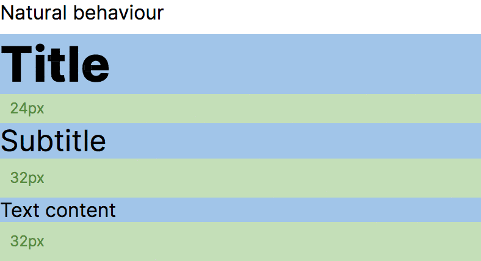

<div align="center">
  
  <br/>
  <br/>
  <p>
    Strip out spacing above and below the first and last lines of a text block
  </p>
  <a href="https://www.npmjs.com/package/leading-trim">
    
  </a>
  <a href="https://github.com/rudeayelo/leading-trim/actions?query=workflow%3ACI">
    
  </a>
  <br />
  <br />
  <a href="#usage">Usage</a> &nbsp; · &nbsp;
  <a href="./examples">Examples</a> &nbsp; · &nbsp;
  <a href="#faq">FAQ</a> &nbsp; · &nbsp;
  <a href="https://codesandbox.io/s/leading-trim-playground-rwnmp">CodeSandbox</a>
  <br />
  <br />
</div>

---

## What's this for?

By default text elements include vertical space based on its `line-height`
value. The effect of that extra space may be overlooked or worked around, but
when working with precise scales and layout components, there's probably no room
for random spacing going around your text.



`leading-trim` is a JavaScript port of **EightShapes**'s
[Text Crop mixin](http://text-crop.eightshapes.com/)
([source](https://github.com/EightShapes/esds-text-crop)). It returns a _CSS
styles object_ ready to be used with any CSS-in-JS library that let's you inject
styles with nested pseudo-elements.

## Install

```sh
npm install leading-trim

# or

yarn add leading-trim
```

## Usage

<sub><a href="#tldr">Skip to the <b>tl;dr</b></a></sub>

`leading-trim` exports a set of functions:

### `leadingTrim`

Use it when you're setting your `font-family` to a custom `@font-face`

<!-- prettier-ignore-start -->
```jsx
import { leadingTrim } from "leading-trim";

leadingTrim({
  lineHeight: 1.5,  // unitless `line-height` that you want for the text
  reference: {      // reference numbers for the `@font-face` you'll use
    fontSize: 40,   // `font-size` in px
    lineHeight: 1,  // unitless `line-height`
    topCrop: 5,     // height to remove from the top in px
    bottomCrop: 6,  // height to remove from the bottom in px
  },
  correction: {     // (optional) adjust the cropping result
    top: 1,         // a positive value shortens the crop
    bottom: -1,     // a negative value expands the crop
  },
});
```
<!-- prettier-ignore-end -->

### `systemFontLeadingTrim`

Use them when you're setting your `font-family` to a typical system font stack:

<!-- prettier-ignore-start -->
```css
body: {
  fontfamily: -apple-system, BlinkMacSystemFont, "Segoe UI", Roboto, Oxygen-Sans, Ubuntu, Cantarell, "Helvetica Neue", sans-serif;
}
```
<!-- prettier-ignore-end -->

The `reference` numbers are already set for this one so you don't have to.
Naturally different operative systems will use different fonts, so it's a close
approximation, you can still use `correction` for your use-case:

<!-- prettier-ignore-start -->
```jsx
import { systemFontLeadingTrim } from "leading-trim";

systemFontLeadingTrim({
  lineHeight: 1.5,  // unitless `line-height` that you want for the text
  correction: {     // (optional) adjust the cropping result
    top: 1,         // a positive value shortens the crop
    bottom: -1,     // a negative value expands the crop
  },
})
```
<!-- prettier-ignore-end -->

### `systemMonoFontReference`

Same as above but for a monospace `font-family` stack:

<!-- prettier-ignore-start -->
```css
body: {
  fontfamily: SFMono-Regular, Menlo, Monaco, Consolas, "Liberation Mono", "Courier New", monospace;
}
```
<!-- prettier-ignore-end -->

<!-- prettier-ignore-start -->
```jsx
import { systemMonoFontReference } from "leading-trim";

systemMonoFontReference({
  lineHeight: 1.5,  // unitless `line-height` that you want for the text
  correction: {     // (optional) adjust the cropping result
    top: 1,         // a positive value shortens the crop
    bottom: -1,     // a negative value expands the crop
  },
})
```
<!-- prettier-ignore-end -->

If the `reference` numbers were correctly matched, you probably won't need
`correction` numbers different than `-1` or `1`.

The output of the above functions is a JS object ready to be used in a CSS-in-JS
library of your choice:

```json
{
  "display": "block",
  "lineHeight": 1.5,
  "&::after": {
    "marginTop": "calc(-0.375em - 1px + -1px)",
  },
  "&::before": {
    "marginBottom": "calc(-0.375em - 1px + 1px)",
  },
  "&::before, &::after": {
    "content": "\\"\\"",
    "display": "block",
    "height": 0,
    "paddingTop": "1px",
    "width": 0,
  }
}
```

The code above will work with **any font size** automatically so it's up to you
if you want to provide it along or just let the element inherit the one from the
parent element.

Check the [examples](./examples) for a more realistic usage.

<sup><b>Disclaimer:</b> My weapon of choice is React so the examples are only
based on that, feel free to PR some other examples using other libraries.</sup>

### tl;dr

1. Use the **EightShapes**'s
   [Text Crop mixin tool](http://text-crop.eightshapes.com/) to obtain the
   `reference` numbers (I got the best results using a line height of `1` and a
   `> 32px` font size)
2. Pass your `lineHeight` and the `reference` numbers from the previous step to
   the `leadingTrim` function
3. Inject the styles object that the function outputs using your prefered
   CSS-in-JS library

## FAQ

### Why do I need those `reference` numbers?

To be able to calculate the size of the top and bottom crop for any given
`line-height`. It's basicaly a rule of 3 so it needs something to compare.

You'll need different reference numbers for each `font-family` you use (not
needed for different `font-weights` as font height is not changing in that
case).

The **EightShapes**'s [Text Crop mixin tool](http://text-crop.eightshapes.com/)
makes it a really easy to get it working fast.

### Where can I find more info about this trick?

I started learning about this technique when I saw it applied in **SEEK**'s
[Braid Design System](https://seek-oss.github.io/braid-design-system/), since
then I've seen other resources that may help you wrap your head around the
issue:

- [michaeltaranto/**basekick**](https://github.com/michaeltaranto/basekick)
- [Line-height Crop - a simple CSS formula to remove top space from your text](https://codyhouse.co/blog/post/line-height-crop)
- [**EightShapes**'s Text Crop mixin intro article](https://medium.com/eightshapes-llc/cropping-away-negative-impacts-of-line-height-84d744e016ce)
- [Getting to the bottom of line height in Figma](https://www.figma.com/blog/line-height-changes/)

### Where did I hear this name before?

There's a
[a CSS proposal to address this natively using the `leading-trim` property](https://drafts.csswg.org/css-inline-3/#leading-trim-property).
This is not trying to pollyfill that property proposal at all, but it does have
a matching purpose:

> By using
> [`leading-trim`](https://drafts.csswg.org/css-inline-3/#propdef-leading-trim)
> to strip out the spacing above the cap height and below the alphabetic
> baseline, centering the box actually centers the text; and does so reliably,
> regardless of what font is used to render it.

---

Built with TypeScript using [**tsdx**](https://github.com/jaredpalmer/tsdx/)
